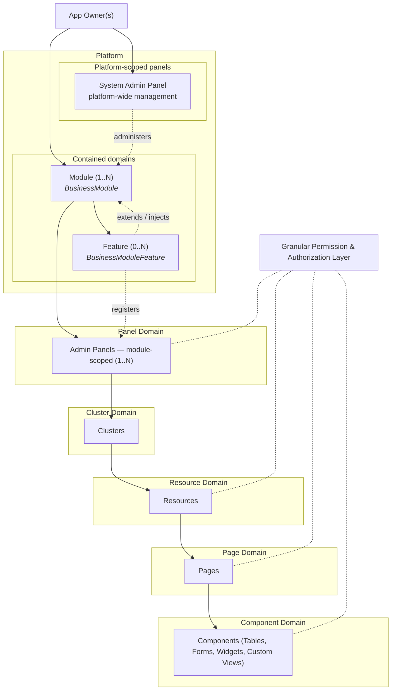

# Webkernel Platform

## Introduction

### What is Webkernel?

Webkernel is a high-performance, cross-platform application kernel and enterprise application builder.

It enables you to construct mission-critical software running seamlessly across web, mobile,
and desktop platforms using explicit PHP primitives.

Webkernel replaces generic framework overhead with a lightweight execution model engineered for complex business environments.
It eliminates execution overhead on the request path, uses Composer for dependency management,
and enforces PSR standards for ecosystem interoperability.

Webkernel does not reject standard tooling or conventions — it eliminates request-path bloat across all target platforms.

## Vision & Product Philosophy
Webkernel is an **application builder**. The kernel stays lean. Composer is how the platform is installed and how dependencies are managed — in the majority of cases:
```bash
composer create-project webkernel/webkernel
```
Rather than wrapping Laravel or Symfony, Webkernel owns its primitives and speaks PSR (container, log, clock, cache, HTTP message / factory / client). PHP extensions the process needs are declared in Composer. A module that requires extra packages owns that graph; it is not a kernel problem.

The objective is **minimum overhead at all**, not an empty `require` block. See [Getting started](x-webkernel/docs/guides/00-getting-started/getting-started.en.md).

---

## Performance Contract

> **These are hard targets, not aspirations. Every architectural decision in this codebase is a consequence of them.**

| Scope | Target | What is included |
| --- | --- | --- |
| **Kernel CPU — no I/O** | **< 1 ms** | Boot, config resolution, routing, middleware stack, ACL/permission resolution, response dispatch |
| **Full application response — with I/O** | **< 10 ms** | Everything above + DB queries, cache reads, view render |

**"Included" means included.** Auth checks, permission lookups, module-scoped ACL resolution, view directive expansion, and middleware evaluation all happen inside the < 1 ms kernel budget.
None of these are exempted. If a composable makes the kernel miss the budget, the composable is the problem — not the target.

---

## Low-Level In-Memory Caching & Hot-Reloading

To guarantee sub-millisecond execution while maintaining dynamic capabilities (where code changes reflect on the immediate next request), the kernel strictly relies on server-local shared memory primitives. Network-bound caches (Redis, Memcached) are forbidden inside the < 1 ms Kernel CPU budget.

### Primary Caching Primitives

* **APCu (Alternative PHP Cache User):** Stores arbitrary PHP variables directly in shared memory (RAM) local to the server process. Operates with zero network hops and zero serialization overhead for native PHP types. Used for resolved routing tables, flattened ACL trees, and compiled config state.
* **OPcache Bytecode Invalidation:** Keeps compiled PHP scripts in shared memory. When application files change, calling `opcache_invalidate($file, true)` instantly purges the stale bytecode without requiring a service restart.
* **Shared Memory (`shmop`):** Low-level POSIX shared memory functions built into PHP. Operates without abstraction layer overhead, but requires manual binary packing and lacks key-value indexing or automatic TTL management.

### Caching Layer Comparison

| Caching Layer | Read Speed | Invalidation Speed | Serialization Overhead | Kernel Fit |
| --- | --- | --- | --- | --- |
| **APCu** | Nanoseconds (Local RAM) | Instant (`apcu_delete`) | **None** (Stores native PHP types) | **Primary** (Routing, ACL, Config) |
| **OPcache** | Nanoseconds (Bytecode) | Instant (`opcache_invalidate`) | **N/A** (Compiled PHP code) | **Primary** (Dynamic Code Execution) |
| **`shmop`** | Nanoseconds (Local RAM) | Manual pointer reset | **High** (Requires manual binary packing) | Special Use Only |
| **Redis / Memcached** | Sub-millisecond (IPC/Network) | Instant (Network command) | **High** (Requires `serialize` / `json_encode`) | Full I/O Budget Only (< 10 ms) |

---

## Dynamic Hot-Reloading Strategy

To show immediate changes on the next request when source files change without sacrificing the < 1 ms CPU target:

1. **Bytecode Invalidation:** Hook file-change listeners or dev-mode file-stat checks to trigger `opcache_invalidate($filePath)` on changed files.
2. **User Cache Eviction:** Cache calculated state (e.g., route maps or ACL structures derived from those files) in APCu. Purge affected APCu keys synchronously via `apcu_delete($key)` or atomic tag flushing when a file update is detected.

---

## Low-Level Implementation Considerations & Gotchas

* **APCu TTL Lock-Out Bug:** Updating an existing key while providing a TTL inside a rapid loop or single long-running request can cause APCu to stop updating the key once the original TTL expires. When mutating high-frequency counters or states in shared memory, prefer atomic operations (`apcu_inc`, `apcu_dec`, `apcu_cas`) or use `apcu_entry()` for lock-free generation.
* **Concurrency Protection:** For high-concurrency writes to APCu (such as cache warming during cold boots), use `apcu_entry()` to ensure atomic generation and prevent cache stampedes.

### Essential APCu API Methods

* `apcu_fetch($key)` / `apcu_store($key, $var, $ttl)` — Core zero-copy read/write operations.
* `apcu_entry($key, $generator_func, $ttl)` — Atomic lock-free fetch-or-create execution.
* `apcu_cas($key, $old_val, $new_val)` — Atomic Compare-And-Swap for concurrency controls.
* `apcu_delete($key)` / `apcu_clear_cache()` — Instant user-space memory invalidation.

### Measured baselines
Environment: PHP 8.4, OPcache on, JIT off, localhost.

| Scenario | Measured |
|---|---|
| Hello World — kernel path only | ~0.02 ms |
| Dashboard render | ~0.33 ms |

### How the targets are enforced architecturally

- **Lazy composable loading** — only composables actually called in a request are resolved. A request that only calls `webapp()->response()` never loads `PlatformComposable`, `AuthComposable`, or any module. Zero allocation for unused composables on the hot path.
- **Singleton / scoped caching** — composable instances are cached in the container after first resolution. Chaining `webapp()->platform()->instance()->machine_uuid()` costs three object-reference reads on every call after the first within the same request.
- **Compile-time ACL expansion** — view directive permission names (`@can('export')`) are expanded to fully qualified calls (`webapp()->acl('invoicing')->can('invoicing.export')`) at compile time, not at render time. Zero runtime overhead for name resolution.
- **No magic methods** — `__call` / `__callStatic` are banned as much as possible. PHPStan / Psalm analyse 100 % of the chain without plugins. No dynamic dispatch on the hot path.
- **OPcache is mandatory** — `config/platform.php` is a plain PHP array. It is `require`d once and cached by OPcache. Config rewrites call `opcache_invalidate()` immediately after the atomic rename.
- **Fast-boot reads config directly** — `platform/bootstrap/fast-boot.php` `require`s the config array before any composable or container is initialised. The hot path exits after the autoload `require`. No abstraction overhead.

Guide: [Performance](x-webkernel/docs/guides/04-performance/performance.en.md)

---

## Architectural Principles

- **Sub-millisecond kernel:** See [Performance Contract](#performance-contract) above. The budget covers routing, middleware, and ACL — not just the empty boot path.
- **Composer is the installer:** `composer create-project`, `composer install`, dump-autoload maps. First-party packages, PSR, extensions, and module dependencies all go through Composer.
- **PSR interoperability:** Enterprise baseline — `psr/container`, `psr/log`, `psr/clock`, `psr/cache`, `psr/http-message`, `psr/http-factory`, `psr/http-client`, plus discovery for HTTP client/factory implementations.
- **Zero magic:** Explicit wiring without magic methods, dynamic auto-discovery, or hidden service provider resolution.
- **Domain-centric abstractions:** Components designed specifically for enterprise business rules, avoiding bloated generic wrappers.

---

## HTTP Kernel
Webkernel is named for the request lifecycle, not only the UI tree.


1. **Request** — Capture at the front controller. PSR HTTP (`psr/http-message`, factory, client) is the enterprise boundary; today's helper is still a thin path object.
2. **Front controller** — `public/index.php` boots `platform/bootstrap/app.php`.
3. **Router** — MarkBased dispatcher owned in-tree (`Webkernel\Route`). Closures stay in memory; compiled routes land in `platform/storage/framework/cache/`.
4. **Pipeline** — Middleware is recorded on the host (`with_middleware`) and on route bindings. The stack is not executed until the HTTP kernel pipeline is wired.
5. **Response** — `WebApp::handle_request()` currently echoes the dispatched body. PSR `ResponseInterface` is the target.
6. **Telemetry** — Access logs, metrics, traces, and profiles write under `platform/telemetry/`. Sinks exist; collectors are not implemented yet.

Guides: [HTTP kernel](x-webkernel/docs/guides/02-http-kernel/http-kernel.en.md) · [Telemetry](x-webkernel/docs/guides/05-telemetry/telemetry.en.md)

---

## Domain & UI Hierarchy
Webkernel structures applications using a multi-panel, modular architecture governed by a fine-grained authorization and permission engine.

### Structural rules
- The **Platform** is the root level managed by one or more **App Owners**. It holds global configuration and contains Modules.
- The **System Admin Panel** is a special *platform-scoped* panel. It administers all Modules but is not a sibling of Modules at the same ownership level. It does not own Module domain models.
- **Modules** are functional domains residing inside the Platform. A Module can expose one or multiple **Admin Panels**, which are *module-scoped*.
- Panels are explicitly typed: every panel is either `platform`-scoped or `module`-scoped. This is not a runtime tag — it is part of the panel's registration contract and is enforced at registration time.



### Hierarchy breakdown
- **Platform:** Root level. Managed by at least one App Owner. Holds global configuration and contains Modules.
- **System Admin Panel:** A platform-scoped panel for global management (instances, modules, owners, telemetry). Sits above Modules operationally; does not own their domain model.
- **Modules:** Functional domains residing inside the Platform. Composer packages (custom types). A single Module can expose one or multiple module-scoped Admin Panels. Extra Composer dependencies are the Module's graph.
- **Admin Panels:** Operational workspaces. Each panel is explicitly typed as `platform` or `module`. Module-scoped panels contain organized Clusters. Platform-scoped panels manage cross-module or platform-wide concerns.
- **Clusters:** Logical groupings used to aggregate related resources within a panel.
- **Resources:** Core business entities managed within a cluster.
- **Pages:** Individual functional views constituting a resource (e.g. List, Create, Edit, Custom View).
- **Components:** UI building blocks inside pages, including data tables, forms, metric widgets, and custom developer-defined views.
- **Granular permissions:** A unified security layer enforcing strict authorization down to panels, resources, pages, and individual components and actions. Permissions are always namespaced by module — there is no global flat permission table. Permission resolution, including module-scoped ACL checks and view directive expansion, is part of the < 1 ms kernel CPU budget.

Guide: [Domain hierarchy](x-webkernel/docs/guides/03-domain-hierarchy/domain-hierarchy.en.md)

---

## Project Layout

```
refactor/
├── public/                      # Web root (index.php front controller)
├── webkernel                    # Host CLI binary
├── composer.json                # Install + dependency graph
├── modules/                     # Modules ([custom repo's]composer packages)
├── platform/
│   ├── bootstrap/               # fast-boot + WebApp configuration
│   ├── modules/                 # Installed business modules
│   ├── storage/                 # Runtime cache, compiled views, instance id
│   └── telemetry/               # Logs, metrics, traces, profiles, buffers
└── x-webkernel/
    ├── docs/guides/             # 00-*, 01-*, ... / 00-*, 01-*, ...{name}.{lang}.md
    └── lifecycle/               # Composer plugin (install paths, dump-autoload)
```

Guide: [Project layout](x-webkernel/docs/guides/01-project-layout/project-layout.en.md)

---

## Local Development & Setup

### 1. Installation
Ensure PHP 8.4+ and OPcache are installed on your host system. Declare the extensions the process needs (`ext-mbstring`, `ext-intl`, `ext-pdo`, ...) in Composer — they are not optional folklore.

Usual install:
```bash
composer create-project webkernel/webkernel
```

This tree (path repositories):
```bash
composer install
composer dump-autoload
```

Composer installs first-party packages, PSR interfaces, and any module dependencies. It also dumps the PSR-4 autoloader and Webkernel maps. Dev tools stay in `--dev`.

### 2. Local HTTP Server
`php webkernel server` is a custom CLI process manager wrapping PHP's built-in development server (`php -S`) plus a Webkernel router script. It is not Swoole, Workerman, or a production process manager. Production is Nginx / Apache / FPM.

```bash
php webkernel server
```

Options:
- `--host=127.0.0.1` — Set binding host (default: `127.0.0.1`).
- `--port=8000` — Set target port (default: `8000`, auto-increments if port is in use).
- `--profile-lifecycle` — Enable request profiling for include execution costs, file paths, and memory usage.
- `--with-jit` — Start the child `php -S` process with Zend JIT enabled (OPcache required).

### 3. Verify OPcache (mandatory)
OPcache is not optional. Without it the < 1 ms kernel target is not achievable. Verify before benchmarking:

```bash
php -r "echo opcache_get_status()['opcache_enabled'] ? 'OPcache Active' : 'OPcache Disabled';"
```

---

## Documentation

Order prefixes sort on disk and are stripped from URLs. Filenames are `{name}.{lang}.md`.

| Guide | Topic |
|---|---|
| [Getting started](x-webkernel/docs/guides/00-getting-started/getting-started.en.md) | Composer, PSR, install, CLI |
| [Project layout](x-webkernel/docs/guides/01-project-layout/project-layout.en.md) | Physical tree |
| [HTTP kernel](x-webkernel/docs/guides/02-http-kernel/http-kernel.en.md) | Request → Response lifecycle |
| [Domain hierarchy](x-webkernel/docs/guides/03-domain-hierarchy/domain-hierarchy.en.md) | Platform → Page model |
| [Performance](x-webkernel/docs/guides/04-performance/performance.en.md) | < 1 ms kernel / < 10 ms full response |
| [Telemetry](x-webkernel/docs/guides/05-telemetry/telemetry.en.md) | On-disk observability contract |
