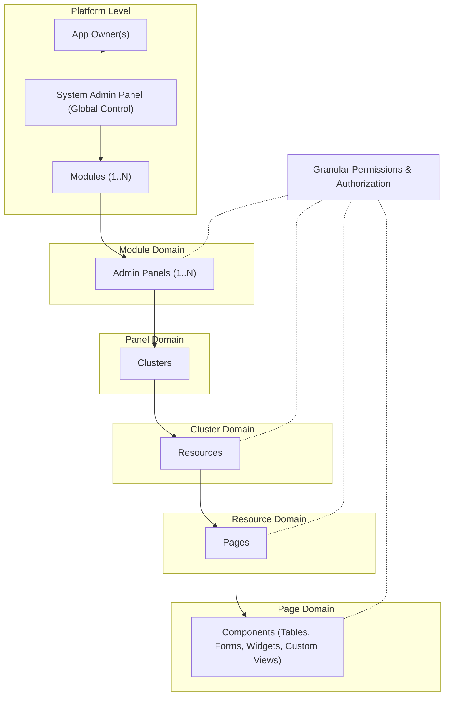

# Webkernel Platform

A high-performance, zero-dependency PHP web kernel and enterprise application builder. Webkernel replaces heavy framework stacks with direct, unabstracted PHP primitives tailored specifically for custom business operations.

## Vision & Product Philosophy

The objective of Webkernel is to provide a complete **application builder without third-party framework dependencies**.

Instead of adding abstract wrappers on top of generic libraries, Webkernel directly integrates and re-adapts core framework utilities to match enterprise realities. By eliminating unnecessary generalization, it delivers maximum execution speed, full architectural control, and absolute independence from external ecosystems.

---

## Domain & UI Hierarchy

Applications built on Webkernel follow a multi-panel, modular structure secured by a fine-grained role and permission system.



### Hierarchy Overview

* **Platform:** Core system level managed by one or more **App Owners**. Houses overall platform state and at least one **System Admin Panel** for global administration.
* **Modules:** Independent domains residing in the platform. A single module can expose one or multiple **Admin Panels**.
* **Admin Panels:** Operational workspaces containing organized **Clusters**.
* **Clusters:** Logical groupings used to aggregate related resources within a panel.
* **Resources:** Primary business entities managed within a cluster.
* **Pages:** Individual screens constituting a resource (Lists, Forms, Details).
* **Components:** UI primitives used inside pages (Data Tables, Metric Cards, Forms, Developer Custom Views).
* **Granular Permissions:** Fine-grained authorization controls assigned across panels, resources, pages, and components.

---

## Architectural Principles

* **Zero External Dependencies:** Native PHP execution tailored to business logic without vendor bloat.
* **Zero Magic:** Explicit wiring without implicit service providers, dynamic auto-discovery, or magic resolution.
* **Domain-Centric Abstractions:** Components designed specifically for enterprise business rules, avoiding bloated generic wrappers.
* **Sub-10ms Execution:** Lightweight HTTP lifecycle optimized for OPcache execution.

---

## Project Structure

```text
webkernel/
├── public/
│   └── index.php             # Single HTTP entry point
├── src/
│   ├── Http/
│   │   ├── Request.php       # HTTP Request capture
│   │   ├── Response.php      # HTTP Response emission
│   │   └── Router.php        # Pattern matching router
│   ├── View/
│   │   └── Renderer.php      # Core UI rendering engine
│   └── Kernel.php            # HTTP lifecycle orchestrator
├── x-webkernel-dev/          # Internal dev packages & modules source code
│   ├── software/
│   ├── software-dev/
│   ├── software-experimental/
│   └── software-modules/
├── composer.json
└── config.php

```

---

## Local Setup

### 1. Installation

```bash
composer install

```

### 2. Local HTTP Server

```bash
php -S localhost:8000 -t public/

```

### 3. Server OPcache Verification

Verify OPcache configuration in production environment:

```bash
php -r "echo opcache_get_status()['opcache_enabled'] ? 'OPcache Active' : 'OPcache Disabled';"
```
