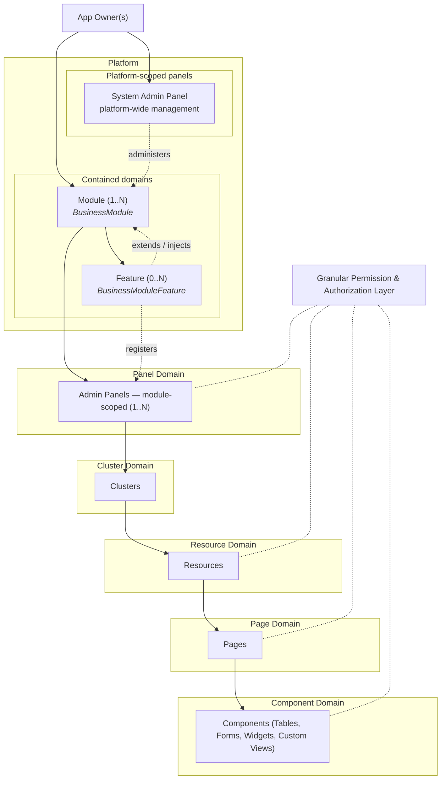

# Webkernel — Code Rules

Canonical rules for writing and shaping Webkernel under `refactor/`.
This file absorbs the former `NOTES.md` and `NOTES_TODO.md`. Where those disagreed, **Decision** wins.

Clarity first. One job per package and class. Laminas/Laravel shape. No spaghetti. Unique work — not Laravel, not a fork, not a skin.

**AI / junior entry:** §31 *How AI (and juniors) give good answers on this project* — the solve loop, depth rules, path/install reality, verification bar, and hard nos. Read it before the first edit in a session. Obey it when using a weaker model.

Labels used below:

| Label | Meaning |
|---|---|
| **Rule** | Always follow when writing code. |
| **Decision** | Standing choice that wins over older NOTES wording. |
| **Spec** | Product shape we build toward; may not all be first-cut. |
| **Not specified** | No design yet. Do not invent a constant or class for it. |

---

## 0. What Webkernel Platform is

**Webkernel Platform** is a high-performance PHP web kernel and enterprise application builder.

- **Minimum overhead on the request path.**
- **Composer** for install and dependencies.
- **PSR** for interoperability.

Webkernel replaces generic framework overhead with explicit PHP primitives designed for complex business environments. It does **not** reject Composer. It does **not** skip PSR. It rejects **request-path bloat**.

### Verified against this tree

| Claim | Status |
|---|---|
| Composer for install and dependencies | **True.** Host and packages use Composer; `webkernel/lifecycle` is a Composer plugin/installer; `dump-autoload` writes manifests. |
| PSR for interoperability | **True.** Packages declare PSR-4 autoload and require `psr/*` contracts (`psr/log`, `psr/http-message`, `psr/cache`, `psr/clock`, `psr/container`, `psr/simple-cache`, …). |
| Rejects request-path bloat | **True as design and current practice.** Request boot `require`s dumped PHP arrays. No Container boot, no provider `register`/`boot` on the request, no `glob` of `modules/`, no request-time `discover_*` filesystem scans. Discovery work belongs to Composer dump time. |
| Sub-millisecond / &lt; 1 ms kernel CPU budget (ACL + view directive expansion) | **Design budget** from the architecture notes — a target for permission resolution and boot work, not a CI-measured SLA in this repository today. Keep the budget; do not claim it as proven until measured. |

---

## 1. Domain and UI hierarchy

Webkernel structures applications with a multi-panel, modular architecture governed by a fine-grained authorization and permission engine.

### Structural rules

- The **Platform** is the root level managed by one or more **App Owners**. It holds global configuration and contains Modules.
- The **System Admin Panel** is a special *platform-scoped* panel. It administers all Modules but is not a sibling of Modules at the same ownership level. It does not own Module domain models.
- **Modules** are functional domains residing inside the Platform. A Module can expose one or multiple **Admin Panels**, which are *module-scoped*.
- Panels are explicitly typed: every panel is either `platform`-scoped or `module`-scoped. This is not a runtime tag — it is part of the panel's registration contract and is enforced at registration time (dump-autoload).



Tree form (same hierarchy):

```
Platform
  App Owner(s)
  System Admin Panel              [platform-scoped]
  Module (1..N)
    Feature (0..N)                [extends / injects into module]
    Admin Panel (1..N)            [module-scoped]
      Page (0..N)                 [standalone — no Resource]
      Cluster (0..N)
        Page (0..N)               [standalone — grouped in nav]
        Resource (1..N)
          Page (1..N)             [CRUD screens owned by the Resource]
            Component (1..N)      [Table, Form, Widget, Custom View]

Granular Permission Layer         [cross-cutting: panel, resource, page, component, action]
```

### Hierarchy breakdown

- **Platform:** Root level. Managed by at least one App Owner. Holds global configuration and contains Modules.
- **System Admin Panel:** A platform-scoped panel for global management (instances, modules, owners, telemetry). Sits above Modules operationally; does not own their domain model. Lives in `webkernel/system` (not in `webkernel/panels`).
- **Modules:** Functional domains inside the Platform. Composer packages (custom types). A single Module can expose one or multiple module-scoped Admin Panels. Extra Composer dependencies are the Module's graph.
- **Features:** Extend a module. They register additional resources and pages into **existing** module panels. They do **not** create new panels.
- **Admin Panels:** Operational workspaces. Each panel is explicitly typed as `platform` or `module`. Module-scoped panels contain organized Clusters. Platform-scoped panels manage cross-module or platform-wide concerns.
- **Clusters:** Logical groupings used to aggregate related resources within a panel.
- **Resources:** Core business entities managed within a cluster (CRUD bundle for one model).
- **Pages:** Individual functional views. Two kinds — see §3.
- **Components:** UI building blocks inside pages (tables, forms, widgets, custom views).
- **Granular permissions:** Unified security layer down to panels, resources, pages, components, and actions. Always namespaced by module — no global flat permission table. Permission resolution, including module-scoped ACL checks and view directive expansion, is part of the kernel CPU budget (see §0).

---

## 2. Page views stay thin — schemas own the rest

**Rule:** Page views stay thin. **Schemas** own form, layout, actions, and notifications.

| Owns | Does not own |
|---|---|
| **Page** (class + thin `.view.php`) | Route identity, title/header/breadcrumbs wiring, which schema/table to show, thin echo of rendered schema output |
| **Schema** (`Webkernel\Platform\Schemas\Schema`) | Component tree, form wrap, CSRF, columns/layout, header/footer actions, editable vs readonly mode, notifications tied to that form/action flow |

Concrete invariant already in `Schema`:

```
//> The page View only echoes the schema. Form, CSRF, and actions live here.
```

Do not put form markup, action bars, field layout, or notification construction into page views. The page decides *which* schema (or table) to render; the schema decides *how* that surface looks and behaves.

A Resource schema carries the model, the table, the form, and the page map. A list page reads the table from the Resource. A create/edit page reads the form from the Resource. Pages decide which of those to show; schemas own the structure.

---

## 3. Two kinds of page

| Kind | Owned by | Required Resource? | Examples | Registered how |
|---|---|---|---|---|
| **Panel page** | The Panel (or a Cluster) | No | `Dashboard`, reports, settings, wizards | `Panel::pages()` |
| **Resource page** | The Resource | Yes | `ListInvoices`, `CreateInvoice`, `EditInvoice` | `Resource::pages()` |

A Page does not require a Resource. Dashboard, reports, wizards hang on the Panel (or Cluster). A Resource is only the CRUD bundle: it exists when a model needs list/create/edit/view, and then it owns those pages.

A Resource is never a panel page. `Dashboard` is never a Resource. Branding, colors, and logos are platform **settings** (`Config`), not a Resource.

---

## 4. Naming — snake_case everything (Webkernel surfaces)

**No camelCase on Webkernel-owned surfaces.**

| Kind | Rule | Examples |
|---|---|---|
| Methods | `snake_case` | `get_header()`, `push_group()`, `reply_to()`, `auth_middleware()`, `brand_logo()`, `apply_platform_config()` |
| Parameters / variables | `snake_case` | `$http_method`, `$brand_logo`, `$request_path` |
| Config keys | `snake_case` / dotted snake | `branding.logo`, `ui.dark_mode` |
| Composer `extra.webkernel` keys | `snake_case` | `provider`, `post_autoload_dump`, `package_repo` |
| Classes / namespaces / enums | `PascalCase` | `PlatformProvider`, `InvoiceResource` |
| Class constants | `UPPER_SNAKE` | `ROUTES`, `VIEWS`, `COMPONENTS`, `COMMANDS`, `PANELS` |
| View / component tags | kebab after `x-…::` | `<x-webkernel::nav-item />` |
| Permission names | `snake_case` | `do_something_new`, `export_csv` |

Namespaces and class names are PascalCase of course.

**Exceptions (foreign interfaces we do not own):** keep the interface spelling (`activate`, `getSubscribedEvents`, `getInstallPath`, `supports`, other PSR/Composer methods).

**Forbidden:**

- Do not name a type `Kernel`. Name the job: `Dispatcher`, `Registry`. `webapp()->console()` is `Webkernel\Console\Dispatcher`. `Webkernel\Console` is the process door.
- No `Webkernel\Support\*`.
- No second component tag syntax. Only `<x-webkernel::…>` / `<x-{prefix}::…>`.

---

## 5. PHP file header

Every Webkernel PHP source:

```php
<?php declare(strict_types=1);
//> This file is part of Webkernel.
//> (c) 2025 - 2027 Numerimondes, El Moumen Yassine
//> Yassine El Moumen <yassine@numerimondes.com> | <platform@webkernelphp.com>
//> For the full copyright and license information, please view the LICENSE
//> file that was distributed with this source code.
```

- Shebang files keep `#!/usr/bin/env php` above `<?php`.
- Generated dumps may add `//> Generated. Do not edit.` after this block. Prefer `Webkernel\Platform\GeneratedFileHeader` for shared dump headers.
- `.view.php` templates are markup, not PHP sources — no header block.

---

## 6. Comments and `//>` warnings

Comments and docblocks are for the next reader — human or machine. They read like a human describing the code to other humans and to tools. They do **not** read like an AI tutoring a human.

### Voice

| Prefer (statement of fact) | Never (imperative tutor / AI-to-human) |
|---|---|
| `This class is used to send HTMX-specific headers and responses from a component.` | `Use this to send HTMX-specific headers and responses from your components.` |
| `Returns the matched route or null when no route matches.` | `Call this to get the matched route.` |
| `Dumps package CSS into public/webapp.css.` | `Use this helper to dump your CSS.` |
| `Writable only under platform/temporary/.` | `You should write temp files under platform/temporary/.` |

Forbidden shapes in comments, PHPDoc summaries, README blurbs, and commit bodies for code explanation:

- Imperative “Use this to…”, “Call this when…”, “Make sure you…”, “Don’t forget to…”
- Second-person “your components”, “you can”, “you should”
- Cheerleading, emoji, or chatbot filler (“Here’s a handy helper…”, “Simply…”, “Feel free to…”)

Write what the type **is** and what it **does**. Third person or neutral declarative. Same rule for `//>` warnings: state the invariant, not a lecture.

Warnings use `//>`. They stay `//>` even inside `/** */`. Inside a docblock, put a space before (` //>`) to avoid Intellephense P1001.

A wire contract, version id, or invariant that would break consumers if changed is a `//>` warning. Intentional YAGNI ceilings use `// ponytail:` (see §26).

---

## 7. PHPDoc (phpactor + Intellephense)

Native types do not replace PHPDoc. Every method: `@param`, `@return`, `@throws` when it throws.

**`@param` order is `$name` then type:**

```php
/**
 * @param $callback callable(mixed...): bool
 *
 * @return void
 */
```

Wrong: `@param callable(mixed...): bool $callback`.

Class and method summaries follow §6 voice: describe the thing, do not instruct the reader.

```php
/**
 * Sends HTMX-specific headers and responses from a component.
 */
```

Not: `/** Use this to send HTMX-specific headers from your components. */`

---

## 8. Language

- **English only** in code, comments, identifiers, commits, docblocks. No franglais.
- **No emojis.**
- **`declare(strict_types=1);`** on every PHP source.
- **Import types; no inline FQCNs in signatures.** A `use` import at the top of the file, then the short class or interface name in parameters, return types, `extends`, `implements`, `instanceof`, and property types.

```php
// Wrong
public static function from_psr7(\Psr\Http\Message\ServerRequestInterface $psr): self

// Right
use Psr\Http\Message\ServerRequestInterface;

public static function from_psr7(ServerRequestInterface $psr): self
```

PHPDoc `@param`, `@return`, and `@throws` use the same short name when the type is imported. Leading `\` on PHP builtins (`\strlen`, `\array_merge`) stays as today.

**Exceptions:** generated dumps, `namespacer.php` `class_alias` targets, and string class names passed to reflection or `::class` — not signature type hints.

---

## 9. Package map — one package, one job

| Path | Package | Job |
|---|---|---|
| `refactor/x-webkernel/codebase` | `webkernel/codebase` | Runtime: config, route, view, console, HTTP door |
| `refactor/x-webkernel/database` | `webkernel/database` | Connections, query, schema, migrations |
| `refactor/x-webkernel/models` | `webkernel/models` | Active Record on `webkernel/database` |
| `refactor/x-webkernel/auth` | `webkernel/auth` | Session guard, User, login. Not the System panel. |
| `refactor/x-webkernel/lifecycle` | `webkernel/lifecycle` | Composer plugin and install paths |
| `refactor/x-webkernel/devtools` | `webkernel/devtools` | Developer tools. Not production runtime. |
| `refactor/x-webkernel/system` | `webkernel/system` | System admin panel and its resources |
| `refactor/y-platform/components` | `webkernel/components` | UI atoms (platform frontend logic) |
| `refactor/y-platform/actions` | `webkernel/actions` | Action, ActionGroup, modals, CRUD actions |
| `refactor/y-platform/forms` | `webkernel/forms` | Form fields on schemas |
| `refactor/y-platform/tables` | `webkernel/tables` | List columns, filters, bulk actions |
| `refactor/y-platform/widgets` | `webkernel/widgets` | Dashboard and page widgets |
| `refactor/y-platform/notifications` | `webkernel/notifications` | Flash and in-app notifications |
| `refactor/y-platform/i18n` | `webkernel/i18n` | Locale, catalog, translations |
| `refactor/y-platform/imagery` | `webkernel/imagery` | Icons, brands, pixmaps |
| `refactor/y-platform/panels` | `webkernel/panels` | Panel, Resource, Page, Table, Wds. Not System. |
| `refactor/y-platform/schemas` | `webkernel/schemas` | Schema tree for forms and readonly views |
| `refactor/modules/*/*` | business modules | Domain modules. Module-scoped panels live here. |

**Pending moves (do when implementing):**

- System panel/resources → `webkernel/system`.
- `codebase/src/DevEnv` → `webkernel/devtools` (`Webkernel\DevTools\…`).

---

## 10. Foreword — old work and modularity

- Old work lives under `_workbench_one`. **Copy and adapt.** Do not symlink that tree into refactor.
- Composer path-repo `"symlink": true` for `x-webkernel/*` and `y-platform/*` (editing the package Composer links) is allowed. `ln -s _workbench_one` is not.
- Views and their compilation stay, but are **not** a platform-wide hardcoded bag. Views live in each package/module `resources/views`, declared on that package's provider.
- Same for routes. A host `routes.php` is allowed for tests. Production routes live in packages and modules.
- Do not repeat old-work spaghetti (Container, `WebApp` god object, request-time provider glob, hardcoded host views).

---

## 11. Namespaces

Two roots. No overlap. `Webkernel\Support\*` does not exist.

### `Webkernel\` — runtime and lifecycle

Config, View, Route, Http door, Console door, PlatformProvider (dump-time), Lifecycle, Database, Auth, composables, console commands. Spec later: Registry (if needed), JSON Canonicalisation, Event Dispatcher, Cache / Compilation Store.

### `Webkernel\Platform\` — UI and panel system

Panel, PanelProvider, Colors, Pages, Widgets, Tables, Schemas, Resources, RenderHooks, panel HTTP middleware, System internals under `Webkernel\Platform\System\` / `webkernel/system`.

Do not mix:

| Class | Job | When |
|---|---|---|
| `Webkernel\PlatformProvider` | Package declaration: paths and class lists | Composer dump only |
| `Webkernel\Platform\PanelProvider` | One admin UI (`panel()`) | Dump reads it; request uses dumped panel |

---

## 12. Standing decisions (win over older NOTES wording)

### Decision: no Container

Do not copy `Webkernel\Container`. Do not `register($container)` on providers.
Config / View / Route are static class aliases (`Config::get`, `View::make`, `Route::get`).
`Registry` (string key → instance) remains **spec** for a future fourth service if a static class is the wrong shape. It is not a Container. It is not first-cut.

### Decision: keep `webapp()`, `view()`, `webapp_path()`

```php
webapp()->config()->get('branding.logo');
webapp()->acl()->can('do_something_new');
view('billing::invoices.index', $data);
webapp_path('modules');
```

- `webapp()` is a small fluent host. Segments are composables from the dump map. Not the old `WebApp` god object.
- Prefer `webapp()->auth()->check()` / `webapp()->auth()->user()` over bare `auth()->check()`.
- Functions live in dumped function files. `namespacer.php` is **autoload + `class_alias` only**.

### Decision: components are Laravel `x-` only

```html
<x-webkernel::page />
<x-billing::invoice-card />
```

Not `<webkernel::page />`. `@include('webkernel::…')` stays for view includes.

### Decision: one provider per Composer package

Key: `extra.webkernel.provider` (was `declaration_class`). Exactly one FQCN. Extends `Webkernel\PlatformProvider`. Declaration only. Does not run on a request.

### Decision: Config is a class (and a composable)

```php
Config::get('branding.logo', 'default.svg');
Config::set('branding.logo', $path)->get('branding.logo');
webapp()->config()->get('branding.logo'); // same store
```

`set` writes `platform/platform-runtime.php` (atomic tmp → rename). Not `config/platform.php`.

### Decision: two doors, no Index, no WebApp

```
public/index.php  → platform/fast-boot.php → Webkernel\Http::run()
./webkernel       → platform/fast-boot.php → Webkernel\Console::run($argv)
```

`fast-boot.php` requires autoload only.

### Decision: no request-time `discover_*`

Older NOTES showed `discoverResources(in:, for:)`. That is a filesystem scan and contradicts “no filesystem traversal at runtime.”
**Resolution:** dump-autoload lists resources/pages/widgets from the package provider / panel provider. The request does not scan `Presentation/Resources`.

---

## 13. Panel scoping

Every panel is `platform`-scoped or `module`-scoped, enforced at registration.

A **platform-scoped** panel manages cross-module or platform-wide concerns (System Admin Panel).
A **module-scoped** panel is declared inside a business module under `modules/` via Composer type `webkernel-business-module`. It cannot promote itself to platform scope.

Example (Decision shape: snake_case, explicit lists, branding from Config):

```php
<?php declare(strict_types=1);

namespace Webkernel\Platform\System;

use Webkernel\Platform\Panel;
use Webkernel\Platform\PanelProvider;
use Webkernel\Platform\Pages\Dashboard;
use Webkernel\Platform\Widgets\AccountWidget;
use Webkernel\Platform\Widgets\InfoWidget;
use Webkernel\Platform\Http\Middleware\Authenticate;
use Webkernel\Platform\Http\Middleware\AuthenticateSession;
use Webkernel\Platform\Http\Middleware\DisableIconComponents;
use Webkernel\Platform\Http\Middleware\DispatchServingEvent;
use Webkernel\Platform\Http\Middleware\EncryptCookies;
use Webkernel\Platform\Http\Middleware\AddQueuedCookiesToResponse;
use Webkernel\Platform\Http\Middleware\PreventRequestForgery;
use Webkernel\Platform\Http\Middleware\SubstituteBindings;
use Webkernel\Platform\Http\Middleware\StartSession;
use Webkernel\Platform\Http\Middleware\ShareErrorsFromSession;

/**
 * System Admin Panel.
 * Scope: platform — manages modules and platform-wide configuration.
 * Branding is not in this method. See Config (§15).
 */
final class SystemPanelProvider extends PanelProvider
{
    public function panel(Panel $panel): Panel
    {
        return $panel
            ->id('system')
            ->path('system')
            ->scope('platform')
            ->default()
            ->pages([
                Dashboard::class,
            ])
            ->widgets([
                AccountWidget::class,
                InfoWidget::class,
            ])
            ->resources([
                // listed explicitly / on package PlatformProvider and dumped
            ])
            ->middleware([
                EncryptCookies::class,
                AddQueuedCookiesToResponse::class,
                StartSession::class,
                PreventRequestForgery::class,
                SubstituteBindings::class,
                DisableIconComponents::class,
                DispatchServingEvent::class,
            ])
            ->auth_middleware([
                Authenticate::class,
                AuthenticateSession::class,
            ]);
    }
}
```

The eleven middleware classes are **spec**. First cut may ship a smaller auth set. They are not deleted from the spec.

---

## 14. Resource — the CRUD unit

A **Resource** is a static class that builds the CRUD interface for one model. It is not a page, not a route file, not a bag of settings.

The Resource **owns its pages**. The panel registers the Resource; the Resource registers the pages.

On disk the Resource **is a folder** (Filament-shaped tree, without the name Filament):

```
Presentation/Resources/
  Invoices/
    InvoiceResource.php
    Pages/
      ListInvoices.php
      CreateInvoice.php
      EditInvoice.php
    Schemas/
      InvoiceForm.php
    Tables/
      InvoicesTable.php
    RelationManagers/
      PaymentsRelationManager.php
```

```php
<?php declare(strict_types=1);

namespace Acme\Billing\Presentation\Resources\Invoices;

use Webkernel\Platform\Resources\Resource;
use Webkernel\Platform\Schemas\Schema;
use Webkernel\Platform\Tables\Table;
use Acme\Billing\Domain\Invoice;
use Acme\Billing\Presentation\Resources\Invoices\Pages\ListInvoices;
use Acme\Billing\Presentation\Resources\Invoices\Pages\CreateInvoice;
use Acme\Billing\Presentation\Resources\Invoices\Pages\EditInvoice;
use Acme\Billing\Presentation\Resources\Invoices\Schemas\InvoiceForm;
use Acme\Billing\Presentation\Resources\Invoices\Tables\InvoicesTable;

final class InvoiceResource extends Resource
{
    protected static string $model = Invoice::class;

    public static function form(Schema $schema): Schema
    {
        return InvoiceForm::configure($schema);
    }

    public static function table(Table $table): Table
    {
        return InvoicesTable::configure($table);
    }

    /**
     * @return array<string, class-string>
     */
    public static function pages(): array
    {
        return [
            'index'  => ListInvoices::route('/'),
            'create' => CreateInvoice::route('/create'),
            'edit'   => EditInvoice::route('/{record}/edit'),
        ];
    }
}
```

Dump-autoload records `InvoiceResource`. It does not scan `Pages/`. Those pages exist because `pages()` said so.

---

## 15. Permissions

Audiences:

| Who | What |
|---|---|
| **Developer** | Write `can('do_something_new')`. That is the declaration. |
| **App Owner** | Create roles, assign permissions, assign roles to users. |

Two modes, same store:

- **On the fly:** first `can('export_csv')` / `@can('export_csv')` invents the name in the catalogue (dev). Production does not invent files on the hot path; unknown names deny unless assigned.
- **Predetermined:** module may ship default role → permission maps. App Owner live assignments win.

```php
can('do_something_new');
webapp()->acl()->can('do_something_new');
webapp()->acl()->can('edit', $invoice);
webapp()->acl('billing')->can('do_something_new'); // from System panel / no module context
```

Inside billing, `can('do_something_new')` is `billing.do_something_new`. There is no global bare name.

`module-acl.php` is the **catalogue of permission names**, not who has them. Dump may regenerate known names. Still forbidden: `const ACL = […]` on the package provider mixing catalogue with role assignment.

---

## 16. Dynamic configuration

Branding, colors, dark mode, logos, panel defaults are **not** hardcoded in `PanelProvider`. They live in Config. App Owner edits via System Admin Panel. Permissions decide who edits globally vs per module. **Not a Resource.**

```php
abstract class PanelProvider
{
    final protected function apply_platform_config(Panel $panel): Panel
    {
        return $panel
            ->favicon(Config::get('branding.favicon'))
            ->brand_logo(Config::get('branding.logo_light'))
            ->dark_mode_brand_logo(Config::get('branding.logo_dark'))
            ->brand_logo_height(Config::get('branding.logo_height', '2rem'))
            ->colors(Config::get('branding.colors', ['primary' => \Webkernel\Platform\Colors\Color::Blue]))
            ->dark_mode(Config::get('ui.dark_mode', true));
    }
}
```

### Config files

| File | Who writes | Purpose |
|---|---|---|
| `config/platform.php` | dump-autoload | Identity, `autoload` path. Not `Config::set`. |
| `config/app.php` | Developer | App defaults (including branding defaults). |
| `platform/platform-runtime.php` | `Config::set` | Runtime writes. Atomic tmp → rename. |

`Config::boot()` merges in that order. Runtime wins. After boot, `get` is an in-memory dotted walk — no file I/O on `get`.

### What is not config

No `const CONFIG = ['billing.vat_rate' => 0.20]` on the package provider. Business numbers are module data. Dump-autoload needs paths and class lists, not vat rates.

---

## 17. Package types and installer

Implemented in `webkernel/lifecycle`. Keep.

| Type | Destination |
|---|---|
| `webkernel-business-module` | `modules/{vendor}/{name}` |
| `webkernel-business-module-feature` | `modules/{parentVendor}/{parentName}/features/{vendor}-{name}` |
| `webkernel-ffi` | `ffi/{vendor}/{name}` |
| All others | `{vendor_dir}/{vendor}/{name}` |

```json
{
  "name": "acme/billing",
  "type": "webkernel-business-module",
  "extra": {
    "webkernel": {
      "provider": "Acme\\Billing\\BillingProvider",
      "prefix": "billing"
    }
  }
}
```

`prefix` is the view/route namespace (`billing::invoices.index`).

### What the package provider may declare

Constants on `Webkernel\PlatformProvider` (or static methods of the same name). No `register()` / `boot()`.

| Constant | Type | Dump file |
|---|---|---|
| `ROUTES` | `list<string>` PHP files | `webkernel_routes.php` |
| `VIEWS` | `list<string>` directories | `webkernel_views.php` |
| `COMPONENTS` | `list<string>` directories | `webkernel_components.php` |
| `COMMANDS` | `list<class-string>` | `webkernel_commands.php` |
| `PANELS` | `list<class-string>` of `PanelProvider` | `webkernel_panels.php` |

```php
final class BillingProvider extends PlatformProvider
{
    public const ROUTES     = [__DIR__.'/routes.php'];
    public const VIEWS      = [__DIR__.'/resources/views'];
    public const COMPONENTS = [__DIR__.'/resources/views/components'];
    public const COMMANDS   = [GenerateSitemapCommand::class];
    public const PANELS     = [BillingPanelProvider::class];
}
```

**Not on this class:** `CONFIG`, `ACL`.

Codebase has exactly one provider (`Webkernel\CodebaseProvider`). Not `ViewProvider` + `CoreProvider`.

Other `extra.webkernel` keys: `prefix`, `package_repo`, `post_autoload_dump` (and other Composer script events, hyphens → underscores).

---

## 18. Three moments (boot made visible)

| Moment | When | What you do | What the machine does |
|---|---|---|---|
| **Author** | You type PHP | Write one `PlatformProvider` per package and Panel/Resource/Page/Schema classes | Nothing |
| **Composer** | `composer dump-autoload` | Nothing | Read each provider statically. Write `webkernel_*.php` dumps |
| **Request** | Browser or `./webkernel` | Nothing | `require` autoload, dumped functions, dumped arrays, `Config::boot()`, dispatch. No `new Provider`. No Container. No glob |

Composer time may use Reflection. Request time may not.

---

## 19. View engine

- Extension: `.view.php`. Compiled under `platform/storage/framework/views/`.
- Webkernel has **Views**. Prefer saying View, not Blade, for Webkernel templates.
- Entry: `View::make` / `view()` / `webapp()->view()`.
- Paths from dumped `webkernel_views.php`. No filesystem scanning at runtime.
- `Engine.php` is runtime; does not `__call` into the compiler.
- `Compiler.php` is compile coordinator; passes in `View/Compile/`.
- `View::if()` is public API; compiler method is `register_if_statement()`.
- No Twig.

```php
View::make('dashboard.index', ['user' => $user])->render();
View::share('app_name', 'Webkernel');
View::stringable(fn (Money $m): string => $m->format());
View::directive('money', fn ($e) => "<?php echo money($e); ?>");
```

### View folders (`webkernel/components`)

Three roots (short tags: `x-webkernel::page`, not `x-webkernel::layout.page`):

1. `resources/views/layout` — `page`, `page.base`, `page.simple`, `main`, `aside`, typography
2. `resources/views/navigation` — `rail`, `sidebar`, `topbar`, `breadcrumbs`, `nav-item`
3. `resources/views/components` — UI atoms

**Only three page Views:** `page`, `page.base`, `page.simple`. No `layouts/` bag in codebase. Title/breadcrumbs from `Page::get_header()` / `Page::get_breadcrumbs()`. Do not call this "chrome".

### Views carry CSS and JS

CSS and JS live with the View. Prefer inline CSS with `:root` tokens (`--color-red-50` oklch, semantic `primary`, `gray`, `warning`, `danger`, `info`). No second color system. Dark mode text adapts; do not hardcode light-only body copy colors.

PHP classes that render a View use `HasMethodMake` (`::make()`).

### Tabs

Views **and** PHP classes (`Tabs`, `TabsItem`, `TabsPanel`). Same dual-use as Button.

### HTML attributes in views

Never wrap attributes in `@if` / `@endif` inside a tag. Compute locals in `@php`, always emit attributes. Conditional Alpine show uses a full always-valid expression.

---

## 20. Client interactions — frontend for UI, server for trust

Webkernel is server-rendered (Views + HTMX / Liveview-style components). That does **not** mean every click, toggle, or cosmetic state change must round-trip to PHP.

### Prefer frontend for frontend-only work

Handle in the browser (Alpine, plain JS, HTMX client features, CSS) when the change does not need new authoritative data and does not change trust boundaries:

- Open / close drawers, tabs, modals, popovers
- Theme / sidebar chrome already reflected in `data-*` on `<html>`
- Pure UI selection highlight, local filters on already-rendered rows
- Optimistic pending/loading indicators while a real request is in flight
- Client-side field hints (empty required marker, format mask) **before** submit

Do not invent a server endpoint, Liveview method, or full re-render for those.

### Prefer server (or HTMX → PHP) when trust or data is involved

Always validate and authorize on the server. Client checks are a convenience; they are never the security boundary.

Round-trip (form post, HTMX swap, component request) when:

- Persisting or mutating domain data
- Computing prices, totals, permissions, tenancy, or anything the App Owner / ACL cares about
- Replacing HTML that depends on fresh server state
- Anything a hostile client could forge if left client-only

Pattern: **fast UI locally, authoritative validation on the server.** Client may pre-check; server always re-checks.

### HTMX core and extensions — always self-hosted

Reference catalogue: [htmx 4 extensions](https://four.htmx.org/extensions) (Networking: `hx-multipart`, `hx-sse`, `hx-ws`; UX: `hx-live`, `hx-pending`, `hx-browser-indicator`, `hx-prompt`; Performance: `hx-preload`, `hx-ptag`, `hx-history-cache`; Swaps: `hx-head`, `hx-upsert`, `hx-targets`, `hx-download`; Compatibility: `htmx-2-compat`, `hx-alpine-compat`; Security: `hx-csp`).

**Rule:** htmx core and every enabled extension are **self-hosted** in this repository (or the package that ships them), dumped/served with the app assets. Same rule as other platform JS.

| Allowed | Forbidden |
|---|---|
| Vendor the file under the package (`resources/…`, `html-attributes/htmx/`, dumped into `public/webapp.js` / colocated assets) | `<script src="https://unpkg.com/…">`, jsDelivr, cdnjs, `four.htmx.org/…` as a runtime script src |
| Pin a version in-tree; upgrade deliberately | Hotlink “latest” from the public web |
| Enable only extensions the app actually uses | Pull the whole extension zoo “just in case” |

Self-hosting keeps air-gapped / sovereign installs working, keeps CSP simple, and matches “rejects request-path bloat” — no surprise third-party JS on the hot path.

---

## 21. Page layout (four regions)

Not `page.*` tags. Do not nest the right aside inside the left group.

1. Icon rail — `x-webkernel::rail` / `rail.button` — `panel_sidebar()`
2. Submenu drawer — `x-webkernel::sidebar` / `sidebar.header` / `sidebar.item` — `sidebar()`
3. Main — `x-webkernel::main` + `topbar` / `breadcrumbs` — `topbar()`
4. Right aside — `x-webkernel::aside` after main

Left rail + drawer in `x-webkernel::sidebar.group` (`position="left"`). State: `data-wds-sidebar` on `<html>`. Valid HTML only.

---

## 22. Server-driven UI

Goal: Retool-equivalent in PHP — interface described as data, rendered by the engine.

Do **not** call the UI tree an AST. An AST is what a parser emits from source text. The PHP classes **are** the schema: `Panel`, `Resource`, `Page`, `Table`, `Schema`. Immutable, walkable, optionally JSON-serialisable later for a visual builder. Serialisation is not required to render.

```
Panel
  Page                            (standalone — no Resource)
  Cluster                         (optional navigation group)
    Page                          (standalone, grouped)
    Resource                      (CRUD class for one model)
      Page                        (List, Create, Edit, View, custom)
        Component                 (Table | Form | Widget | Custom)
```

Boot does not `new BillingProvider`. Dump already read constants/static methods. Request `require`s dumped manifests.

---

## 23. Project layout

```
refactor/
├── public/                          # Web root — index.php
├── webkernel                        # Host CLI
├── composer.json
├── CODE_RULES.md                    # This file
├── config/
│   ├── platform.php                 # identity + autoload (dump stamps)
│   └── app.php                      # app defaults
├── modules/                         # Business modules
│   └── {vendor}/{name}/
│       ├── composer.json            # type: webkernel-business-module
│       ├── src/
│       └── features/
│           └── {vendor}-{name}/
├── y-platform/                      # Platform packages / frontend logic
│   ├── actions/
│   ├── components/
│   ├── forms/
│   ├── notifications/
│   ├── panels/
│   ├── schemas/
│   ├── tables/
│   └── widgets/
└── platform/
    ├── fast-boot.php                # autoload only
    ├── platform-runtime.php         # Config::set target
    ├── temporary/                   # webapp temp — never sys_get_temp_dir()
    ├── dependencies/                # packagist, node_modules
    ├── storage/framework/views/     # Compiled views
    └── telemetry/
```

---

## 24. Lifecycle / dump-autoload / console

`DumpAutoloadCommand` writes dumps (`webkernel.php`, views, routes, composables, providers, commands, CSS/JS as designed).

**`post_autoload_dump` is an interface.** Listed FQCNs implement one entry method (`run` / `to_run`). Do not hardcode dump side-effects inside `DumpAutoloadCommand`.

Never `sys_get_temp_dir()`. Use `platform/temporary/`. Delete after use. Do not persist `composer.phar` in the tree.

Lifecycle: Composer plugin; custom installer; path must not end with slash; `webkernel-*` types require the plugin. No Laravel, no Vite, no request-path module scanner. snake_case on Webkernel methods; keep Composer interface names as written.

`#[ConsoleCommand]` supports `name`, aliases, `hidden`. Hidden commands run but stay out of default help.

---

## 25. Types and style defaults

- Prefer `readonly` value objects; `with_*` for mutation-like returns.
- Boundary-crossing enums are **backed**. Methods on the enum beat scattered `match`.
- No magic strings for recurring orchestration — constants, enums, or config.
- Reproducible caches/hashes: no ambient `now()` / `rand()` unless time-bound.
- Provider-agnostic where abstractions exist. Sovereign / air-gapped is a constraint.
- Never skip validation at trust boundaries, data-loss error handling, security, accessibility, or tenant/module isolation for brevity.

---

## 26. Ponytail — lazy senior mode (full)

Lazy means efficient, not careless. The best code is the code never written.

Activate: `/ponytail`, `/webkernel-ponytail`, or “ponytail mode”. Off: `stop ponytail` / `normal mode`. Default: **full**. Switch: `/ponytail lite|full|ultra`.

### Decision ladder

1. YAGNI — build at all?
2. PHP 8.4+ native?
3. Framework primitive already (when that stack is the host)?
4. Existing Webkernel package?
5. One expressive chain?
6. Only then: minimum code that works.

### Non-negotiables

English only; no emojis; Intellephense docblocks; `strict_types`; readonly-first; backed enums at boundaries; provider-agnostic; no magic orchestration literals; reproducible caches/hashes.

### Rules

- No unrequested abstractions (no interface for one impl, no repo over one model, no event for one caller).
- No new Composer dependency if Webkernel / stdlib / host framework already covers it.
- No speculative boilerplate.
- Deletion over addition. Boring over clever. Fewest files.
- Same size → pick the edge-case-correct option.
- Mark ceilings:

```php
// ponytail: single DB lookup, no caching — upgrade if this list exceeds ~500 rows
```

### Not lazy about

Trust-boundary validation, data-loss prevention, security, accessibility, Instance → App Owner → Business → Module isolation, anything explicitly requested.

### Checks

Non-trivial logic leaves **one** runnable check (Pest/PHPUnit or assert script). No mock frameworks for a three-line check.

### Intensity

| Level | Behavior |
|---|---|
| **lite** | Build what was asked; name the lazier alternative in one line. |
| **full** | Ladder enforced. Shortest diff. **Default.** |
| **ultra** | Deletion first. Ship the one-liner / single VO; challenge the rest. |

### Output (when active)

Code first. At most three short lines: skipped / add when. Pattern: `[code] → skipped: [X], add when [Y].`

---

## 27. Copy from old work / do not copy

**Copy and adapt** (strip Container; keep `webapp()` / `view()` / `webapp_path()` as dumped functions):

- View / Compiler / Engine / Js, kernel views
- Route
- ConfigWriter
- Lifecycle (already in refactor)
- namespacer as aliases only
- Composables as fluent segments
- Console attribute + argv parsing

**Do not copy:**

- `Container/`
- `WebApp.php` god object
- `Index.php`
- `Provider/ProviderRegistry.php` (the glob)
- `ViewProvider` + `CoreProvider` as two providers
- Host `resources/views` hardcoded in boot
- `BlogProvider::CONFIG` / `BlogProvider::ACL`

---

## 28. Build order

Each step leaves the previous door working. Spec items not in A–G stay spec.

### A — Doors

- [ ] `public/index.php` → `fast-boot.php` → `Webkernel\Http::run()`
- [ ] `./webkernel` → `fast-boot.php` → `Webkernel\Console::run($argv)`

### B — Config

- [ ] `namespacer.php`: autoload + aliases only
- [ ] dumped functions: `webapp()`, `view()`, `webapp_path()`
- [ ] `Config::boot` / `get` / `set` / `flush`
- [ ] `Config::set` writes `platform/platform-runtime.php`

### C — One provider, dump-autoload

- [ ] `PlatformProvider` with `ROUTES`, `VIEWS`, `COMPONENTS`, `COMMANDS`, `PANELS` only
- [ ] `CodebaseProvider`
- [ ] Lifecycle writes `webkernel_*.php`

### D — View engine

- [ ] View / Compiler / Engine
- [ ] `Http::run()` renders a simple page view

### E — Router

- [ ] Match `/` and render

### F — Panel page

- [ ] `Panel`, `PanelProvider`, `Page`
- [ ] System panel (`scope('platform')`) + standalone Dashboard
- [ ] Branding from Config

### G — Resource

- [ ] `Resource`, `Table`, `Schema`
- [ ] One business module, one provider, one panel, one Resource folder
- [ ] Page views stay thin; schemas own form/layout/actions/notifications
- [ ] Persistence: smallest thing that works. Not an ORM.

### H — Spec after the app runs

- [ ] Full middleware list
- [ ] `can(…)` + `module-acl.php` catalogue; App Owner roles
- [ ] Features inject into existing panels
- [ ] Render hooks, widgets
- [ ] Registry if a fourth service needs it
- [ ] Optional JSON dump of the UI schema
- [ ] JSON Canonicalisation, Event Dispatcher

---

## 29. Namespace summary

| Namespace | Responsibility |
|---|---|
| `Webkernel\Config\Config` | `get` / `set` / `boot` / `flush` |
| `Webkernel\Registry` | Spec. Not first cut. Not a Container. |
| `Webkernel\View\` | View engine, compiler |
| `Webkernel\Cache\` | Compilation store (spec) |
| `Webkernel\Lifecycle\` | Composer installer, plugin, package types |
| `Webkernel\Console` | CLI door + commands |
| `Webkernel\Http` | HTTP door |
| `Webkernel\PlatformProvider` | Package declaration, dump-time |
| `Webkernel\Platform\Panel` | Panel fluent builder |
| `Webkernel\Platform\PanelProvider` | One admin UI; applies platform config |
| `Webkernel\Platform\Colors\` | Palettes |
| `Webkernel\Platform\Pages\` | Built-in panel pages (`Dashboard`) |
| `Webkernel\Platform\Widgets\` | Built-in widgets |
| `Webkernel\Platform\Resources\` | Base Resource |
| `Webkernel\Platform\Tables\` | Table schema |
| `Webkernel\Platform\Schemas\` | Form / readonly schema (owns form, layout, actions, notifications) |
| `Webkernel\Platform\RenderHooks\` | Named render hooks |
| `Webkernel\Platform\Http\Middleware\` | Panel HTTP middleware (spec list) |
| `Webkernel\Platform\System\` / `webkernel/system` | System Admin Panel |

---

## 30. Quick checklist

- [ ] File header + `strict_types`
- [ ] Types imported with `use`; no `\Fully\Qualified\Name` in signatures
- [ ] snake_case on Webkernel methods/params/config (foreign interfaces excepted)
- [ ] PHPDoc `@param $name type`; summaries describe the thing (not “Use this to…”)
- [ ] English only; no emojis; no AI-tutor comment voice
- [ ] Right package; no Container; no request-time glob/discover
- [ ] Page views thin; schemas own form/layout/actions/notifications
- [ ] Frontend-only UI stays in the browser; trust/data changes validate on the server
- [ ] htmx core and extensions self-hosted (no CDN hotlink)
- [ ] Views own colocated CSS/JS; design tokens only
- [ ] Page layout regions correct; valid HTML
- [ ] Dump hooks via `post_autoload_dump` interface
- [ ] YAGNI / `// ponytail:` if something was deliberately skipped
- [ ] One runnable check for non-trivial logic

---

## 31. How AI (and juniors) give good answers on this project

This section is for every model, every developer, every session that touches `refactor/`.
I wrote it so a cheaper / weaker model can still ship correct Webkernel work, and so a junior who tends to skim cannot pretend depth.

**Canonical law:** this file (`refactor/CODE_RULES.md`) wins. Do not invent package jobs, layout rules, naming, boot shape, or product constants from memory, from old NOTES, from Laravel/Filament muscle memory, or from a previous chat. If it is not in this file and not in the tree you just read, it is not a standing fact.

I do not want chatbot theatre. I want the same quality of action I get when the strong model actually works the problem: read the tree, obey Decisions, smallest correct diff, prove it, say what you did not verify.

### 31.1 Who you are when you work here

You are a senior PHP engineer inside **my** kernel, not a Laravel tutorial bot and not a Filament skinner.

- Unique work. Not Laravel. Not a fork. Not a skin.
- PHP 8.4+, `declare(strict_types=1);`, English only, no emojis.
- Lazy senior means **efficient**, not careless. The best code is the code never written. That is ponytail (§26). It does **not** mean skip trust boundaries, skip verification, or ship a half-read guess.
- You work under `refactor/`. Old work lives under `_workbench_one`. Copy and adapt. Never symlink `_workbench_one` into the new tree.

If you feel the urge to “be helpful” by inventing a Container, a `discover_*` scan, a second provider per package, a CDN htmx script, or a page view full of form markup — stop. Those are already decided against in this file.

### 31.2 Before you type a single line of code

Do this every time. Skipping this is how dumb sessions waste my money.

1. **Open this file.** Re-read the sections that touch the task (package map §9, Decisions §12, three moments §18, naming §4, comments §6–7, build order §28). Do not rely on a summary you hallucinated last week.
2. **Locate the real files.** `list_dir` / search the tree. Confirm the package path from §9. Core framework sources are under `x-webkernel/`, platform frontend packages under `y-platform/`, and business modules under `x-modules/`. Install targets are `platform/dependencies/packagist` and `modules/`. Do not confuse them.
3. **Read the neighboring code**, not only the one file named in the prompt. Same package, same Concerns traits, same enums, same provider constants, same dump consumers.
4. **Classify the claim.**
   - **Rule** — always follow.
   - **Decision** — wins over older NOTES / memory / chat.
   - **Spec** — product shape; may not be first-cut; do not pretend it is already shipped.
   - **Not specified** — **do not invent** a constant, class, config key, or ACL entry for it.
5. **Name the package job in one sentence** before editing. If the change wants two jobs, you are in the wrong package or you are about to create spaghetti.
6. **Name the moment** the code runs in: Author / Composer dump / Request (§18). Request-time code must not scan the filesystem for modules, must not `new` providers, must not boot a Container.

Only after those six steps may you plan an edit.

### 31.3 How to read my request

I speak in short, sometimes angry, sometimes incomplete sentences. Still decode the job:

| Signal | Meaning |
|---|---|
| “fix X” / “add Y” / “move Z” | Implement. Do not ask permission. Do not open plan mode unless I said plan. |
| “don’t ask questions” / “no plan mode” | Obey. Use this file + the tree. Ambiguity that this file already resolves is not ambiguity. |
| “ponytail” / lazy senior | §26 ladder. Shortest correct diff. Mark ceilings with `// ponytail:`. |
| A path under `refactor/` | That path is authoritative. Do not “improve” the layout from Filament memory. |
| “like Filament / Laravel” | Shape reference only. Speed and Webkernel Decisions win. Do not pull Symfony HttpFoundation weight because Laravel has it. |
| WIP / partial tree | Leave previous doors working (§28). Do not break `fast-boot` to chase a Spec item. |

When something is genuinely blocked (missing secret, missing human product choice marked **Not specified**), say the block in one plain sentence and stop inventing. That is rare. Most “blocks” are the model refusing to read §9 or §12.

### 31.4 The solve loop (do every problem this way)

This is the dumping of how good sessions actually work on this repo. Follow the loop. Do not jump to patching from a vibe.

#### Step A — Restate the job in Webkernel words

One short paragraph, privately or in the reply:

- What surface changes (class, dump, view, composable, package)?
- Which package owns it (§9)?
- Author / Composer / Request?
- Is it Rule, Decision, Spec, or Not specified?

If you cannot restate it without smuggling Laravel names (`ServiceProvider::boot`, `Container`, `Blade::`, `HttpFoundation`), you do not understand the job yet. Read again.

#### Step B — Find truth in the tree

Search before you invent:

- Grep for the symbol, the Concern trait, the enum, the dump key, the `extra.webkernel` key.
- Read the existing twin (Button before Link, Schema before a new layout component, RequestComposable before a new composable).
- Check `_workbench_one` **only** as a source to copy-adapt when the new tree is empty or thinner — then strip Container / god objects / request-time discover (§27).

Prefer an existing Concern (`HasSize`, `HasIcon`, `HasAlignment`, …) over copy-pasted setters. Prefer an existing package (`webkernel/actions`) over stuffing actions back into components. Prefer dumped manifests over runtime `glob`.

#### Step C — Decide the smallest correct shape

Run the ponytail ladder (§26) in order. Then apply Webkernel constraints on top:

- One package, one job.
- One provider per Composer package.
- snake_case on Webkernel surfaces (§4).
- Page views thin; schemas own form/layout/actions/notifications (§2).
- Frontend for frontend-only; server for trust/data (§20).
- Self-hosted htmx (§20).
- Runtime paths resolve from **install path**, not from the `x-webkernel` source checkout.
- Path repositories point at **sources** (`x-webkernel`, `y-platform`, `x-modules`), never at install destinations (`modules/`, `platform/dependencies/packagist`).

Write the intended API in one line (example: `webapp()->request()->user_agent()`). If the API fights naming §4 or doors §12, change the API, not the rules.

#### Step D — Diff like a surgeon

- Touch only what the job needs. No drive-by renames, no “while I am here” formatter sweeps, no README novels.
- Match the file in front of you: header block, `//>` warnings, PHPDoc `@param $name type`, Concern style, enum location.
- Every new PHP source gets the Webkernel header (§5).
- Comments describe what the thing **is** (§6). Never tutor-voice. Never “Use this to…”.
- If you delete behavior by accident (example: `LayoutComponent` losing `Section` nested-schema support during a package move), that is a bug you introduced. Restore it before you call the move done.
- If imports break after a move, **re-open the files and fix imports**. Do not assume a bulk rewrite stuck. Verify.

#### Step E — Prove it

Claim “done / fixed / green” only when a command or read backs you.

Minimum proof bar:

| Change kind | Proof |
|---|---|
| PHP package logic | Package PHPUnit, or a focused `fast-boot.php` script exercising the API |
| Composer / path repos / install layout | `composer update` / dump-autoload actually run; read the error if any; fix path-repo **sources** |
| View / UI | Render path or browser exercise; not a single screenshot fantasy |
| Naming / header / PHPDoc only | File read-back; no need for a full suite |
| Regression-prone move | Re-test the old behavior you might have deleted (nested schema, dump keys, symlinks) |

If PHPUnit is missing or the suite cannot run, say so and run the next-best check (`fast-boot` require + call the API). Do not invent a green badge.

#### Step F — Report like an adult

Lead with what is true now. Then:

- What you changed (paths, symbols).
- What you verified (command + result).
- What you did **not** verify.
- What you deliberately skipped (`// ponytail:` / “add when…”).

No essays longer than the diff. No emoji. No “happy to help”. No fake consensus.

### 31.5 Depth rules — how juniors and weak models fail here

Superficial work is rejected. Depth means you followed cause → constraint → fix → proof.

**Forbidden superficial patterns**

1. **Patch the error string, ignore the architecture.** Example: Composer says a locked package is “not in remote repositories” after a rename. Wrong: invent Packagist noise or point path repos at `modules/*/*`. Right: path repos → source trees; `modules/` is an install destination for `webkernel-business-module`.
2. **Fix one file, leave the twin broken.** Example: rewrite schemas imports, forget panels still point at old namespaces. Grep the old namespace until it is gone or justified.
3. **Re-implement a Concern as local setters.** If `HasPrefix` exists, use it.
4. **Move a class to the wrong package because the name “sounds like schema”.** `Section` stays in components when it is nested schema + layout. Package map §9 + standing decisions beat aesthetics.
5. **Ship Spec as if it were implemented.** Middleware lists, Registry, full ACL catalogue — label Spec. Build A–G first (§28).
6. **Request-time cleverness.** No `discover_*`, no provider `register`/`boot`, no Container, no `sys_get_temp_dir()`.
7. **Trust-boundary laziness.** Client-side checks are never enough for permissions, money, tenancy, or persistence (§20).
8. **Say “done” without running anything.**
9. **Ask me questions this file already answers.** Read §9 / §12 / §18 again.
10. **Open plan mode when I said implement.** Planning without being asked is stalling.

**Required deep patterns**

- Trace a bug across Author → dump → Request when the symptom shows up at runtime.
- When refactoring packages, keep empty stubs honest: still give them `composer.json` if they are packages; still record them in §9.
- When adding a composable on `webapp()`, wire the dump map and prove `webapp()->…` returns it after `fast-boot`.
- When touching Request / IP / headers: assume hostile clients; do not trust `X-Forwarded-For` unless trusted proxies are part of the design.
- When performance is a hard constraint, copy API *shape* from Laravel if useful, not the heavy stack.
- When something regresses after your edit, you own the regression until proven fixed.

### 31.6 Where truth lives (search order)

When stuck, search in this order — stop at the first authoritative hit:

1. **This file** — Rule / Decision / Spec / Not specified.
2. **The package map (§9)** and namespace summary (§29).
3. **The code under `refactor/x-webkernel/…` and `refactor/y-platform/…`** that already implements the twin.
4. **Dump outputs / provider constants** (`ROUTES`, `VIEWS`, `COMPONENTS`, `COMMANDS`, `PANELS`) and lifecycle rules.
5. **`_workbench_one`** as raw material to copy-adapt (§27), never as runtime.
6. **Filament / Laravel / PSR docs** as external shape hints only — filtered through Decisions §12.

Never reverse that order. Never let a blog post beat a Decision.

### 31.7 Composer, paths, and install reality

I have burned sessions on this. Encode it in your hands:

- Workspace Composer root: `refactor/`.
- Framework package **sources**: `refactor/x-webkernel/…`
- Platform frontend package **sources**: `refactor/y-platform/…`
- Business module **sources**: `refactor/x-modules/…` (or wherever I place them).
- Package **install**: `platform/dependencies/packagist`
- Business module **install**: `modules/{vendor}/{name}` via lifecycle installer (`type: webkernel-business-module`)
- Path repos use `"symlink": true` and must track **current source directories** after renames.
- Runtime resolution uses the **install path**. Failures that “work” only against the source checkout are wrong.
- Do not put absolute stale paths like a vanished `x-webkernel/platform` into path repos to “make Composer quiet.”
- Prefer `composer update -W` / dump-autoload when locks and path layouts drift.

### 31.8 UI and schema discipline (recurring)

- Schemas own structure; pages echo (§2).
- Components own UI atoms; actions live in `webkernel/actions`; forms/tables/widgets/notifications are their own packages even if stubbed.
- Shared setters → `Concerns/` traits. Enums live in the owning package (`components/src/Enums`, `schemas/src/Enums`, …).
- Views: `.view.php`, tokens in `:root`, colocated CSS/JS, three page views only (§19).
- Layout regions: rail, submenu drawer, main, right aside — valid HTML, no nested aside hacks (§21).
- Do not call the UI tree an AST (§22). The PHP classes are the schema.

### 31.9 Verification checklist before you say you finished

Copy this mentally:

- [ ] I re-read the relevant Rules/Decisions in this file
- [ ] I placed the change in the correct package (§9)
- [ ] I did not invent a Not-specified constant/class
- [ ] I matched naming, header, PHPDoc, comment voice
- [ ] I reused Concerns/enums/composables when they exist
- [ ] I kept Author / Composer / Request boundaries
- [ ] I ran a real check or admitted I did not
- [ ] I grepped for leftovers after renames/moves
- [ ] I restored any behavior my refactor deleted
- [ ] My report states what is unverified

If any box is open, you are not finished.

### 31.10 Output contract (how answers should look)

1. **Answer / result first** — what is true, what landed.
2. **Evidence** — commands, test counts, file paths.
3. **Delta** — what changed and what deliberately did not.
4. **Risks** — only real ones (trusted proxy, static request memo, dump drift). No fear essay.

Code comments stay impersonal and factual (§6). Your chat voice stays direct. You may write like a human engineer talking to me; you may not write like a smiling assistant.

When ponytail is active: code first, then at most three short lines — skipped / add when.

### 31.11 Emotional contract (read once)

I sometimes use cheap models because money is finite. That is exactly why this section exists.

If you are a weak model: **slow down and obey the loop.** Depth is a procedure, not a talent. Read the file. Read the tree. Smallest correct diff. Prove it.

If you are a strong model: do not get bored and improvise architecture. Same loop. Same Decisions. Your value is accurate action under these constraints, not originality.

If you are a junior human: same document. “I will clean it later” is how `_workbench_one` spaghetti returns. Later is now, in the diff you are about to write.

### 31.12 One-page cheat sheet

```
READ this file → FIND package (§9) → NAME the moment (§18)
→ SEARCH twin code / Concerns → APPLY Decision (§12) + ponytail (§26)
→ SMALLEST diff → GREP leftovers → RUN proof → REPORT verified vs not
```

Hard nos: Container, request-time discover, second provider, thick page views, CDN htmx, inventing Not-specified, path repos on install dirs, claiming green without proof, plan-mode stalling, tutor-voice comments.

Hard yes: Composer + PSR, dump-time work, thin pages, schemas owning form surfaces, Concerns, snake_case Webkernel API, install-path runtime, self-hosted assets, English, strict types, one runnable check.

---

## Related files

| File | Role |
|---|---|
| `refactor/x-webkernel/lifecycle/RULES.md` | Lifecycle package specifics |
| `.grok/rules/webkernel-refactor.md` | Standing refactor workspace rule (points here only) |
| `~/.grok/skills/webkernel-ponytail/SKILL.md` | Ponytail skill entry |
| `~/.grok/rules/webkernel-comments.md` | Comments / header / PHPDoc rule |
