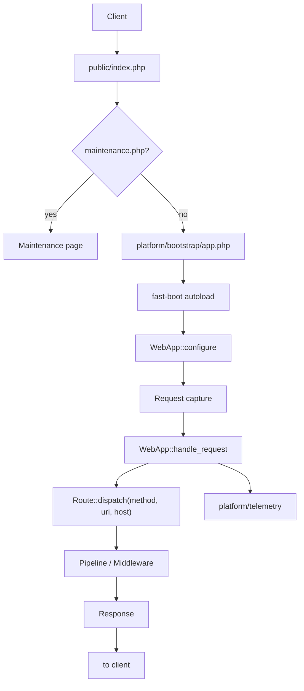

# HTTP kernel

The product name is Webkernel because the unit of work is one HTTP request, not a UI kit. The domain tree (Platform → Page) sits *on top* of this cycle.

PSR HTTP (`psr/http-message`, `psr/http-factory`, `psr/http-client`, discovery packages) is the interoperability layer for an enterprise kernel. Today's capture helper is still a thin path object; the boundary is moving toward PSR, not away from it.

## Lifecycle



### 1. Front controller

`public/index.php` stamps `START_REQUEST` with `hrtime(true)`, optionally includes `platform/storage/maintenance.php`, then boots the app and handles one captured request.

### 2. Request

`Webkernel\Http\Request` currently stores method, URI (query string stripped), and host. `Request::is('api/*')` drives exception JSON routing.

That helper is not a substitute for `Psr\Http\Message\ServerRequestInterface`. The kernel will speak PSR HTTP at the boundary (message, factory, client). The router still matches path **strings**; it does not need a PSR-7 URI object inside MarkBased.

### 3. Boot

`platform/bootstrap/app.php` requires `fast-boot.php` (Composer autoload), then:

```php
return WebApp::configure()
    ->with_middleware(function (Middleware $middleware): void {})
    ->with_exceptions(function (Exceptions $exceptions): void {
        $exceptions->should_render_json_when(
            fn (Request $request) => $request->is('api/*'),
        );
    })
    ->with_routes()
    ->create();
```

`create()` boots providers from dump-autoload (`webkernel_providers.php`) plus host `declare()`. View, route, and command maps are dumped files. No request-path glob.

### 4. Router

`Webkernel\Route` owns the FastRoute MarkBased engine in-tree. One dispatcher strategy. Fluent bindings attach platform metadata (`panel()`, `cluster()`, `resource()`, `page()`, `permission()`, `middleware()`).

Compiled routes: `platform/storage/framework/cache/routes_{hash}.php`. Hash/mtime over declared route files. Closures skip the compile file and stay in memory.

### 5. Pipeline

`Webkernel\Platform\Middleware` records the stack via `webapp()->middleware()->with_middleware()`. `WebApp::handle_request()` runs it as a flat pipeline, then dispatches the router. Permission checks go through `webapp()->acl()`.

### 6. Response

`WebApp::handle_request()` emits a PSR `ResponseInterface` when the dispatcher returns one (status, headers, body). String bodies still echo. Status codes on the local server come from `http_response_code()`.

### 7. Telemetry

After (and around) the response, the kernel is expected to write:

- access log line → `platform/telemetry/logs/access/`
- counters / histograms → `platform/telemetry/metrics/`
- span tree → `platform/telemetry/traces/spans/`
- optional CPU/memory sample → `platform/telemetry/profiles/`

The directory contract is in place. Collectors and exporters are not. See [Telemetry](../05-telemetry/telemetry.en.md).

## Local server vs production

`php webkernel server` wraps `php -S` with `Console\Server\Engine` and `router.php`. Static files under `public/` are served by the built-in server; everything else includes `public/index.php`. `--profile-lifecycle` times includes on that child process.

Production does not use this runner. Point Nginx / Apache / FPM at `public/`.
