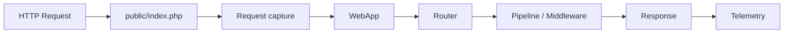
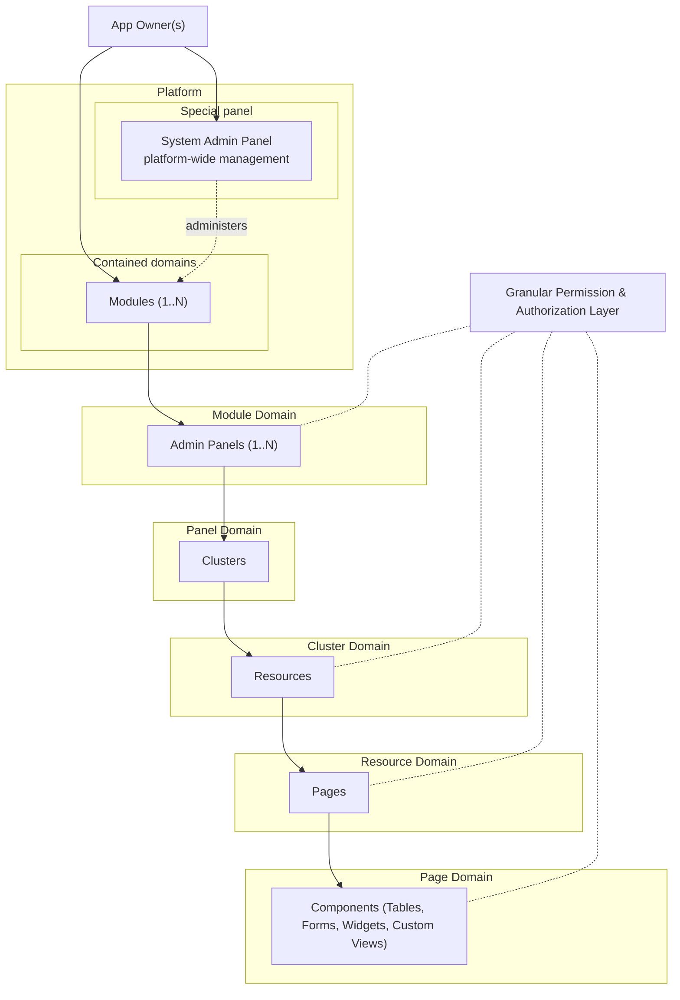

# Webkernel Platform

A high-performance PHP web kernel and enterprise application builder. Minimum overhead on the request path. Composer for install and dependencies. PSR for interoperability.

Webkernel replaces generic framework overhead with explicit PHP primitives designed for complex business environments. It does not reject Composer. It does not skip PSR. It rejects request-path bloat.

## Vision & Product Philosophy

Webkernel is an **application builder**. The kernel stays lean. Composer is how the platform is installed and how dependencies are managed — in the majority of cases:

```bash
composer create-project webkernel/webkernel
```

Rather than wrapping Laravel or Symfony, Webkernel owns its primitives and speaks PSR (container, log, clock, cache, HTTP message / factory / client). PHP extensions the process needs are declared in Composer. A module that requires extra packages owns that graph; it is not a kernel problem.

The objective is **minimum overhead at all**, not a empty `require` block. See [Getting started](x-webkernel/docs/guides/00-getting-started/getting-started.en.md).

---

## Architectural Principles

* **Minimum overhead:** Sub-1 ms core kernel CPU with no I/O / sub-10 ms full application responses with I/O, native OPcache. PSR interfaces and PHP extensions are in-bounds. Illuminate, Symfony HTTP, and request-time package discovery are not on the hot path.
* **Composer is the installer:** `composer create-project`, `composer install`, dump-autoload maps. First-party packages, PSR, extensions, and module dependencies all go through Composer.
* **PSR interoperability:** Enterprise baseline — `psr/container`, `psr/log`, `psr/clock`, `psr/cache`, `psr/http-message`, `psr/http-factory`, `psr/http-client`, plus discovery for HTTP client/factory implementations.
* **Zero Magic:** Explicit wiring without magic methods, dynamic auto-discovery, or hidden service provider resolution.
* **Domain-Centric Abstractions:** Components designed specifically for enterprise business rules, avoiding bloated generic wrappers.

---

## HTTP Kernel

Webkernel is named for the request lifecycle, not only the UI tree.



1. **Request** — Capture at the front controller. PSR HTTP (`psr/http-message`, factory, client) is the enterprise boundary; today's helper is still a thin path object.
2. **Front controller** — `public/index.php` boots `platform/bootstrap/app.php`.
3. **Router** — MarkBased dispatcher owned in-tree (`Webkernel\Route`). Closures stay in memory; compiled routes land in `platform/storage/framework/cache/`.
4. **Pipeline** — Middleware is recorded on the host (`with_middleware`) and on route bindings. The stack is not executed until the HTTP kernel pipeline is wired.
5. **Response** — `WebApp::handle_request()` currently echoes the dispatched body. PSR `ResponseInterface` is the target.
6. **Telemetry** — Access logs, metrics, traces, and profiles write under `platform/telemetry/`. Sinks exist; collectors are not implemented yet.

Guides: [HTTP kernel](x-webkernel/docs/guides/02-http-kernel/http-kernel.en.md) · [Telemetry](x-webkernel/docs/guides/05-telemetry/telemetry.en.md)

---

## Domain & UI Hierarchy

Webkernel structures applications using a multi-panel, modular architecture governed by a fine-grained authorization and permission engine.

The **System Admin Panel** is a special platform panel. It is not a sibling of Modules at the same ownership level: the Platform contains Modules; the SAP administers them.



### Hierarchy Breakdown

* **Platform:** The root level managed by at least one **App Owner**. It holds global configuration and contains Modules.
* **System Admin Panel:** A dedicated platform panel for global management (instances, modules, owners, telemetry). It sits above Modules operationally; it does not own their domain model.
* **Modules:** Functional domains residing inside the platform. Composer packages (custom types). A single module can encapsulate one or multiple **Admin Panels**. Extra Composer dependencies are the module's graph.
* **Admin Panels:** Operational workspaces containing organized **Clusters**.
* **Clusters:** Logical groupings used to aggregate related resources within a panel.
* **Resources:** Core business entities managed within a cluster.
* **Pages:** Individual functional views constituting a resource (e.g., List, Create, Edit, Custom View).
* **Components:** UI building blocks inside pages, including data tables, forms, metric widgets, and custom developer-defined views.
* **Granular Permissions:** A unified security layer enforcing strict authorization down to panels, resources, pages, and individual components/actions.

Guide: [Domain hierarchy](x-webkernel/docs/guides/03-domain-hierarchy/domain-hierarchy.en.md)

---

## Project Layout

```
refactor/
├── public/                      # Web root (index.php front controller)
├── webkernel                    # Host CLI binary
├── composer.json                # Install + dependency graph
├── platform/
│   ├── bootstrap/               # fast-boot + WebApp configuration
│   ├── modules/                 # Installed business modules
│   ├── storage/                 # Runtime cache, compiled views, instance id
│   └── telemetry/               # Logs, metrics, traces, profiles, buffers
└── x-webkernel/
    ├── docs/guides/             # 00-*, 01-*, … / {name}.{lang}.md
    └── lifecycle/               # Composer plugin (install paths, dump-autoload)
```

Guide: [Project layout](x-webkernel/docs/guides/01-project-layout/project-layout.en.md)

---

## Local Development & Setup

### 1. Installation

Ensure PHP 8.4+ and OPcache are installed on your host system. Declare the extensions the process needs (`ext-mbstring`, `ext-intl`, `ext-pdo`, …) in Composer — they are not optional folklore.

Usual install:

```bash
composer create-project webkernel/webkernel
```

This tree (path repositories):

```bash
composer install
composer dump-autoload
```

Composer installs first-party packages, PSR interfaces, and any module dependencies. It also dumps the PSR-4 autoloader and Webkernel maps. Dev tools stay in `--dev`.

### 2. Local HTTP Server

`php webkernel server` is a custom CLI process manager wrapping PHP's built-in development server (`php -S`) plus a Webkernel router script. It is not Swoole, Workerman, or a production process manager. Production is Nginx / Apache / FPM.

```bash
php webkernel server
```

*Options:*

* `--host=127.0.0.1` : Set binding host (default: `127.0.0.1`).
* `--port=8000` : Set target port (default: `8000`, auto-increments if port is in use).
* `--profile-lifecycle` : Enable request profiling for include execution costs, file paths, and memory usage.
* `--with-jit` : Start the child `php -S` process with Zend JIT enabled (OPcache required).

### 3. Server OPcache Verification

Verify OPcache status in production environment to guarantee targeted performance benchmarks:

```bash
php -r "echo opcache_get_status()['opcache_enabled'] ? 'OPcache Active' : 'OPcache Disabled';"
```

Local measured baselines (PHP 8.4, OPcache on, JIT off, localhost): Hello World ~0.02 ms kernel path; dashboard render ~0.33 ms. Targets: **under 1 ms kernel CPU with no I/O**, **under 10 ms full application response with I/O**.

Guide: [Performance](x-webkernel/docs/guides/04-performance/performance.en.md)

---

## Documentation

Order prefixes sort on disk and are stripped from URLs. Filenames are `{name}.{lang}.md`.

| Guide | Topic |
| --- | --- |
| [Getting started](x-webkernel/docs/guides/00-getting-started/getting-started.en.md) | Composer, PSR, install, CLI |
| [Project layout](x-webkernel/docs/guides/01-project-layout/project-layout.en.md) | Physical tree |
| [HTTP kernel](x-webkernel/docs/guides/02-http-kernel/http-kernel.en.md) | Request → Response lifecycle |
| [Domain hierarchy](x-webkernel/docs/guides/03-domain-hierarchy/domain-hierarchy.en.md) | Platform → Page model |
| [Performance](x-webkernel/docs/guides/04-performance/performance.en.md) | Under 1 ms / under 10 ms |
| [Telemetry](x-webkernel/docs/guides/05-telemetry/telemetry.en.md) | On-disk observability contract |
